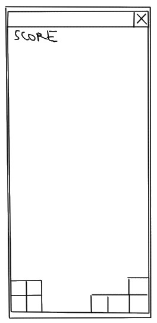

..
   Copyright (C) 2017 Kacy Thorne

   This file is part of Clontris.

   Clontris is free software: you can redistribute it and/or modify
   it under the terms of the GNU General Public License as published by
   the Free Software Foundation, either version 3 of the License, or
   (at your option) any later version.

   Clontris is distributed in the hope that it will be useful,
   but WITHOUT ANY WARRANTY; without even the implied warranty of
   MERCHANTABILITY or FITNESS FOR A PARTICULAR PURPOSE.  See the
   GNU General Public License for more details.

   You should have received a copy of the GNU General Public License
   along with this program.  If not, see <http://www.gnu.org/licenses/>.

Design
======

Summary
-------
Deliver a bare-bones Tetris clone.

Gameplay
--------
Gameplay is similar to *Tetris*. The game will follow some guidelines in the `Tetris Guideline`_ that affect specific game mechanics (see Guidelines section below).

See:

- `Gameplay overview of Tetris <http://harddrop.com/wiki/Gameplay_overview>`_
- `Tetris Guideline`_

Game mechanics
--------------
Refer to: http://harddrop.com/wiki/Category:Game_Mechanics

Interface:

- `Tetrominos`_
- `Playfield`_
- `Orientation`_
- `Spawn Location`_

Mobility:

- `Gravity (Drop)`_
- `Hard Drop`_ (no `lock delay`_)
- `Super Rotation System (SRS)`_ (no `kicks`_)
- `Shift`_

Scoring:

- `Line clear`_
- `Scoring`_

Losing:

- `Top-Out`_

Other:

- `Randomizer`_

Guidelines
^^^^^^^^^^
The game will follow the `Tetris Guideline`_ specifications for:

- Playfield size
- Tetromino start locations and orientation (see SRS above)
- Topping out

Audience
--------
Platform: Linux, Windows 7+, Android (maybe)

User Interface
--------------
- Windowed (no fullscreen), containing just Playfield and score

  Playfield size in pixels (minimum): 240 x 528

- No buttons or menus
- No configuration options

Input methods
^^^^^^^^^^^^^
Keyboard:

- Z: Rotate left
- X: Rotate right
- LEFT: Shift left
- RIGHT: Shift right
- SPACE: Hard drop

Starting, pausing and quitting the game
^^^^^^^^^^^^^^^^^^^^^^^^^^^^^^^^^^^^^^^
- Start the game by launching the program from the OS
- Pause the game by clicking outside the window
- Quit the game by topping-out or clicking the close button

Technical
---------
- Requirements

  - Linux, Windows 7 & over
  - 800 x 600 resolution

- Target FPS: 60

Tools
-----
- Python 3
- Kivy

What to name the game?
----------------------
Possible titles (regex):

- ``[CKQ]lon[kq][uw][a4]d`` -- clone + quad (four)
- ``[CKQ]lontris`` -- clone + tetris
- ``kvBloks`` -- kivy + blocks
- ``kvT(etr[ao]|ris)`` -- kv (kivy) + tetra (four) / tetromino / tetris
- ``[kK]i?v[dD]ris`` -- kivy + dris (tetris)

Best (using above):

- Clonquad
- Clontris
- Kivtris
- kvTris

.. note:: Decided on Clontris

Reference
---------
- `Glossary at Hard Drop's Tetris Wiki <http://harddrop.com/wiki/Glossary>`_
- `Let's Compare (Tetris) -- YouTube (A showcase of different tetris games) <https://www.youtube.com/watch?v=H1yQQZm7Vvc>`_

.. LINKS
.. -----

.. _Gravity (Drop): http://harddrop.com/wiki/Drop#Gravity
.. _Hard Drop: http://harddrop.com/wiki/Drop#Hard_drop
.. _Line clear: http://harddrop.com/wiki/Line_clear
.. _lock delay: http://harddrop.com/wiki/Glossary#L
.. _kicks: http://harddrop.com/wiki/Glossary#K
.. _Orientation: http://harddrop.com/wiki/Orientation
.. _Playfield: http://harddrop.com/wiki/Playfield
.. _Randomizer: http://harddrop.com/wiki/Glossary#R
.. _Scoring: http://harddrop.com/wiki/Scoring
.. _Shift: http://harddrop.com/wiki/Glossary#S
.. _Spawn Location: http://harddrop.com/wiki/Spawn_Location
.. _Super Rotation System (SRS): http://harddrop.com/wiki/Super_Rotation
.. _Tetris Guideline: http://harddrop.com/wiki/Tetris_Guideline
.. _Tetrominos: http://harddrop.com/wiki/Tetromino
.. _Top-Out: http://harddrop.com/wiki/Top_out
